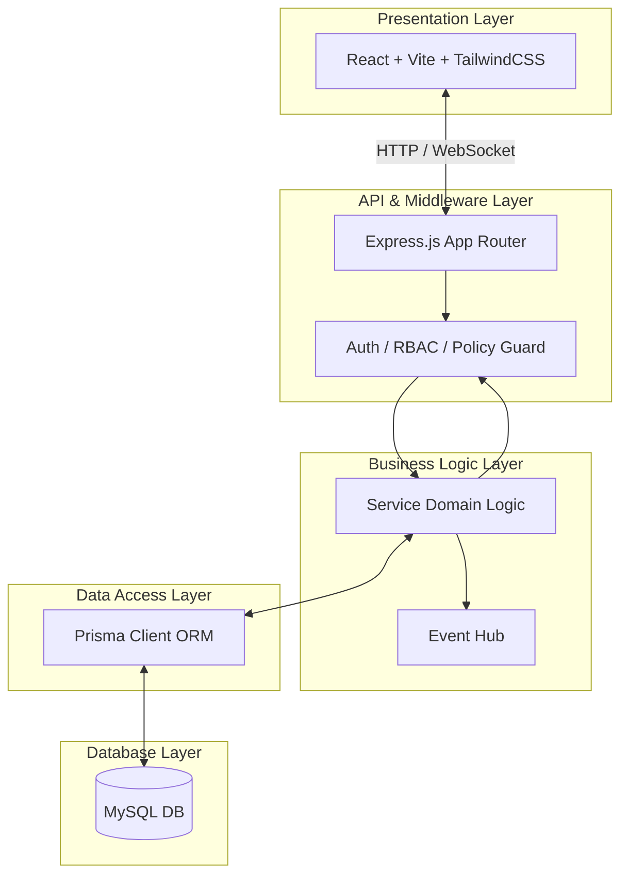
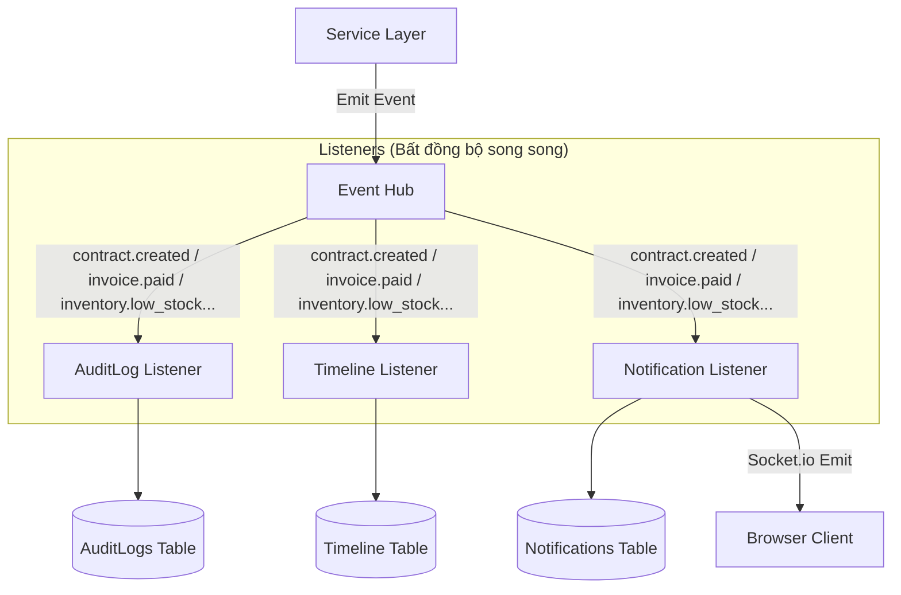
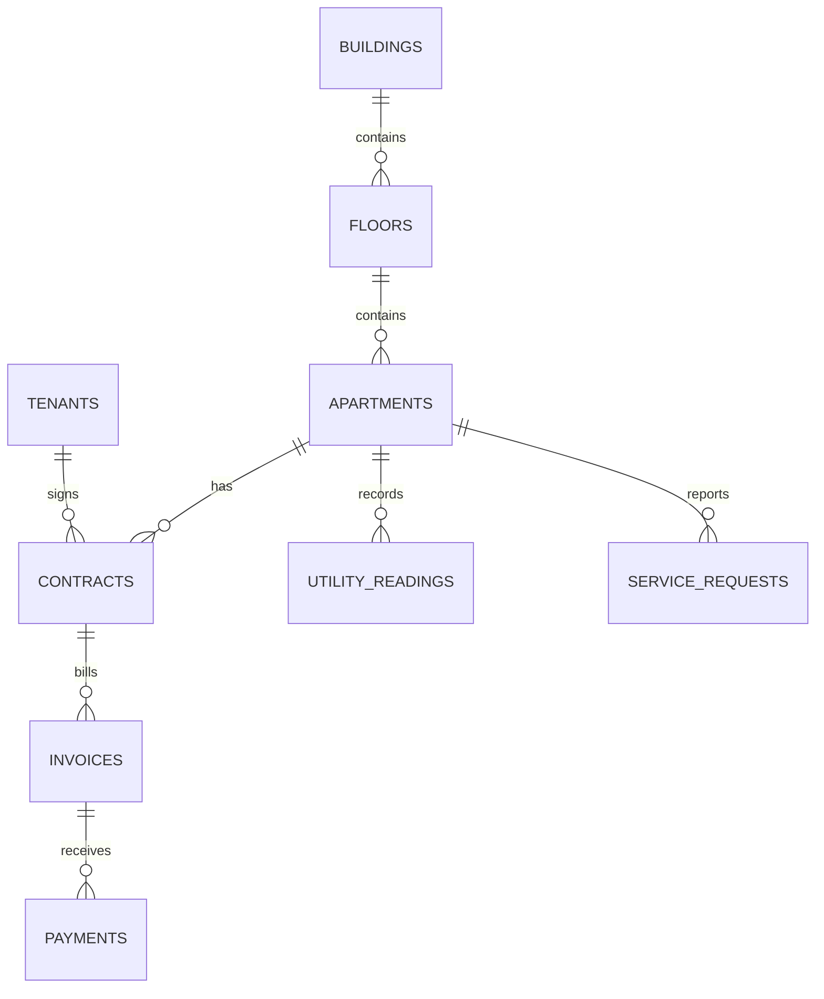

# 🏢 QLCHDC — Hệ thống Quản lý Căn hộ Dịch vụ

> Hệ thống quản lý vận hành nội bộ dành cho đơn vị kinh doanh căn hộ dịch vụ (Admin, Manager, Receptionist, Technician).  
> Kiến trúc **Layered (Phân tầng)** + **Event-Driven (Hướng sự kiện)** + **Real-time Socket.io**.

---

## 📊 Thống kê Hệ thống (System Statistics)

| Chỉ số | Số lượng | Tài liệu chi tiết |
|--------|:---:|-------------------|
| **Backend Modules** | 20 | [Tóm tắt Module](#3-các-module-cốt-lõi-core-modules) |
| **Database Models** | 35+ | [database.md](./docs/database.md) |
| **REST APIs** | 85+ | [api.md](./docs/api.md) |
| **Cron Jobs** | 2 | [Background Jobs](#8-tác-vụ-chạy-ngầm-background-jobs) |
| **Event Types** | 12 | [Event System](#7-hệ-thống-sự-kiện-event-system) |
| **Notification Types** | 8 | [Thông báo real-time](./docs/architecture.md#bell-đồng-bộ-real-time-socketio) |
| **Roles (Nhân sự)** | 4 | [permissions.md](./docs/permissions.md) |

---

## 1. Tổng quan Dự án (Project Overview)

QLCHDC giải quyết trọn vẹn bài toán quản lý tài sản, cư trú và tối ưu dòng tiền vận hành của chuỗi căn hộ dịch vụ. Hệ thống được phát triển dưới dạng **Monorepo (pnpm workspaces)** giúp đồng bộ dễ dàng giữa các module backend và frontend độc lập.

**Các bài toán cốt lõi đã được giải quyết:**
- Quản lý tài sản phân cấp (Tòa nhà $\rightarrow$ Tầng $\rightarrow$ Căn hộ).
- Số hóa hồ sơ cư trú của Khách thuê và tự động hóa vòng đời Hợp đồng.
- Ghi nhận chỉ số tiện ích động và cơ chế tự động lập Hóa đơn hàng tháng.
- Quản lý công nợ gối đầu và khấu trừ tài chính thông qua Ví tích lũy hợp đồng.
- Tiếp nhận sự cố sửa chữa nhanh chóng qua mã QR dán tại phòng mà không bắt buộc khách thuê phải login.
- Quản lý Kho vật tư vận hành của từng tòa nhà, cảnh báo tồn kho thấp và khấu trừ tự động khi sửa chữa sự cố.
- Quản lý Tài sản cố định của tòa nhà, biểu đồ tính khấu hao động theo phương pháp đường thẳng và tra cứu nhanh qua mã QR.

---

## 2. Kiến trúc Hệ thống (Architecture Overview)

### Kiến trúc Phân tầng (Layered Architecture)
Hệ thống tuân thủ chặt chẽ nguyên lý phân tách trách nhiệm (Separation of Concerns) qua mô hình 5 tầng:

### Kiến trúc Hướng Sự kiện (Event-Driven Architecture)
Event Hub (in-process) đảm nhiệm việc truyền tin bất đồng bộ nhằm tách rời luồng nghiệp vụ chính khỏi các listener phục vụ: Ghi nhật ký kiểm toán, lịch sử timeline và đẩy thông báo Socket.io.

> 📄 Xem phân tích kiến trúc chi tiết tại [architecture.md](./docs/architecture.md).

---

## 3. Các Module Cốt lõi (Core Modules)

Hệ thống được module hóa thành 20 workspaces độc lập:

1. **`auth`**: Xác thực JWT (Access 8h + Refresh 7d) & phân quyền RBAC.
2. **`building`**: Quản lý thông tin Tòa nhà, Tầng và Căn hộ.
3. **`tenant`**: Lưu trữ hồ sơ cư trú và thông tin cá nhân của khách thuê.
4. **`contract`**: Quản lý vòng đời hợp đồng thuê và các đợt gia hạn.
5. **`finance`**: Ghi nhận chỉ số điện nước, cấn trừ tiền dư và lập hóa đơn.
6. **`service-requests`**: Tiếp nhận và quản lý tiến trình xử lý sự cố.
7. **`expense`**: Quản lý chi phí vận hành chi ra của tòa nhà.
8. **`notifications`**: Hệ thống thông báo in-app và đẩy real-time qua Socket.io.
9. **`audit-log`**: Nhật ký dấu chân kiểm toán toàn hệ thống.
10. **`search`**: Tìm kiếm song song trên 5 thực thể chính.
11. **`calendar`**: Lịch biểu hiển thị hạn hợp đồng, hạn hóa đơn và bảo trì.
12. **`policy`**: Policy Engine phân quyền quản lý theo tòa nhà được gán.
13. **`workflow`**: State machine quản lý các bước chuyển trạng thái động.
14. **`rules`**: Engine động quét và đánh giá các quy tắc nghiệp vụ từ DB.
15. **`attachments`**: Đính kèm file đa phương tiện thông qua Cloudinary.
16. **`comments`**: Cho phép trao đổi nội bộ trên phiếu sự cố.
17. **`report`**: Thống kê doanh thu, tỷ lệ lấp đầy căn hộ.
18. **`public`**: Cổng quét mã QR công cộng tiếp nhận yêu cầu từ phòng khách thuê.
19. **`inventory`**: Quản lý kho hàng vật tư vận hành của từng tòa nhà và nhập/xuất kho.
20. **`assets`**: Quản lý tài sản cố định, quét mã QR và khấu hao động.

> 📄 Xem chi tiết tóm tắt API của từng module tại [api.md](./docs/api.md).

---

## 4. Luồng Nghiệp vụ Chính (Key Business Workflows)

Vòng đời nghiệp vụ của hệ thống được vận hành tự động qua các quy trình liên kết chặt chẽ:
- **Luồng ký hợp đồng (Onboarding)**: Tạo khách thuê $\rightarrow$ Ký hợp đồng $\rightarrow$ Căn hộ tự động chuyển sang `OCCUPIED` $\rightarrow$ Kích hoạt ví dư `ContractCredits`.
- **Luồng hóa đơn hàng tháng**: Ghi điện nước $\rightarrow$ Tính toán tiền theo chỉ số/khoán $\rightarrow$ Tự động cấn trừ số dư ví $\rightarrow$ Lập hóa đơn $\rightarrow$ Cộng dồn nợ cũ (nếu có).
- **Luồng thu tiền & Hoàn dư**: Tạo phiếu thu $\rightarrow$ Cập nhật hóa đơn $\rightarrow$ Chuyển phần tiền đóng thừa thành số dư tích lũy kỳ sau.
- **Luồng xử lý sự cố & Trừ kho**: Khách quét QR phòng $\rightarrow$ Gửi yêu cầu public $\rightarrow$ Manager gán việc $\rightarrow$ Kỹ thuật viên xử lý, khai báo vật tư đã dùng $\rightarrow$ Hệ thống tự động trừ kho an toàn (Atomic Update) và ghi nhật ký xuất kho $\rightarrow$ Chuyển trạng thái sang RESOLVED.

> 📄 Xem chi tiết các luồng nghiệp vụ và sơ đồ Mermaid tại [workflows.md](./docs/workflows.md).  
> 📄 Xem tài liệu tổng quan ca sử dụng (Use Cases) dành cho BA/Product tại [system-overview.md](./docs/system-overview.md).

---

## 5. Mô hình Bảo mật & Phân quyền (Security Model)

Hệ thống áp dụng mô hình phân quyền hai lớp:
1. **Role-Based Access Control (RBAC)**: Phân quyền theo 4 vai trò chính thông qua JWT middleware.
2. **Policy Engine (Resource-Level Scope)**: Lọc dữ liệu tự động. Manager hay Technician chỉ nhìn thấy và thao tác được các căn hộ, hợp đồng, hóa đơn, kho vật tư, tài sản thuộc tòa nhà mà họ được phân công trong bảng `BuildingAssignments`.

> 📄 Xem chi tiết ma trận phân quyền và hướng dẫn middleware tại [permissions.md](./docs/permissions.md).

---

## 6. Thiết kế Cơ sở Dữ liệu (Database Design)

Mô hình dữ liệu được chia làm 2 tầng chính:
- **Core Domain Models**: `Users`, `Buildings`, `Apartments`, `Tenants`, `Contracts`, `Invoices`, `Payments`, `UtilityReadings`, `ServiceRequests`, `BuildingExpenses`, `Warehouses`, `InventoryItems`, `StockTransactions`, `Assets`, `ServiceRequestMaterials`.
- **Supporting Models**: `AuditLogs`, `Notifications`, `Timeline`, `Attachments`, `ContractCredits`, `BuildingAssignments`, `BusinessRules`, `WorkflowTransitions`, `ApartmentTokens`.

> 📄 Xem chi tiết kiểu dữ liệu, composite indexes và cascade rules tại [database.md](./docs/database.md).

---

## 7. Hệ thống Sự kiện (Event System)

Mọi thay đổi trạng thái nghiệp vụ quan trọng đều phát đi sự kiện qua `EventHub`:
- **Contract Events**: `contract.created`, `contract.updated`, `contract.terminated`, `contract.renewed`, `contract.expired`.
- **Invoice Events**: `invoice.created`, `invoice.paid`, `payment.received`.
- **Maintenance Events**: `maintenance.created`, `maintenance.assigned`, `maintenance.completed`.

> 📄 Xem chi tiết cấu trúc payload sự kiện và cơ chế listener tại [architecture.md#kiến-trúc-hướng-sự-kiện-event-driven-architecture](./docs/architecture.md#kiến-trúc-hướng-sự-kiện-event-driven-architecture).

---

## 8. Tác vụ Chạy ngầm (Background Jobs)

Hệ thống thiết lập 2 tiến trình chạy ngầm tự động (Cron Jobs) lúc `00:00` hàng ngày:
1. **Cron hết hạn hợp đồng**: Quét toàn bộ hợp đồng có `end_date < today` đang ở trạng thái `ACTIVE` hoặc `EXPIRING_SOON` $\rightarrow$ Tự động cập nhật về `EXPIRED`, giải phóng Căn hộ về `AVAILABLE` và emit event `contract.expired`.
2. **Cron Business Rules**: Quét các điều kiện thiết lập động (như gửi cảnh báo hợp đồng sắp hết hạn trước 30 ngày, gửi nhắc nhở hóa đơn quá hạn đóng) $\rightarrow$ Tự động tạo và đẩy thông báo real-time đến nhân viên liên quan.

---

## 9. Thách thức Kỹ thuật đã Giải quyết (Technical Challenges Solved)

- **Cân đối Tài chính Ví dư (Credit & Debt Rollover)**: Giải quyết triệt để vấn đề thu thừa/thiếu tiền phòng. Phần tiền đóng thừa của khách thuê tự động được kết chuyển thành Credit, lưu trữ an toàn trong `ContractCredits` và cấn trừ tự động vào hóa đơn tháng tiếp theo. Nợ cũ chưa thanh toán cũng được gối đầu và cộng dồn vào `debt_amount` hóa đơn mới.
- **Tiếp nhận Yêu cầu qua QR Bảo mật**: Khách thuê quét mã QR tại phòng để gửi phản ánh sự cố không cần login. Token QR (`ApartmentTokens`) được mã hóa ngẫu nhiên, giới hạn hiệu lực 90 ngày nhằm triệt tiêu nguy cơ brute-force gửi yêu cầu giả mạo phá hoại hệ thống.
- **Không chặn tiến trình chính (Non-blocking Operations)**: Tách riêng luồng nghiệp vụ chính với việc lưu Audit Log và Notification. Nếu quá trình ghi log hay đẩy thông báo lỗi, nghiệp vụ chính (Ký hợp đồng, thanh toán) vẫn hoàn thành bình thường.
- **Bảng lỗi tập trung (Exception Catalog)**: Đồng bộ mã lỗi nghiệp vụ với 25 exception codes cụ thể giúp client phản hồi toast UI trực quan và kỹ sư dễ dàng kiểm tra lịch sử log.
  > 📄 Xem chi tiết danh mục lỗi tại [exceptions.md](./docs/exceptions.md).

---

## 10. Nợ Kỹ thuật đã Xác định (Known Technical Debt)

Hệ thống có 3 điểm nợ kỹ thuật lớn nhất cần khắc phục khi mở rộng quy mô:
1. **DB Transaction**: Một số luồng cập nhật ví dư và tạo hóa đơn đang chạy các câu lệnh riêng lẻ, cần gộp chung vào trong `prisma.$transaction([])` để đảm bảo tính toàn vẹn dữ liệu.
2. **In-process Event Hub**: Event Hub chạy in-process bằng `EventEmitter` của Node.js, có thể gây nghẽn CPU chính khi lượng event phát sinh lớn, cần chuyển đổi sang hàng đợi ngoài như **Redis BullMQ**.
3. **QR Token Security**: Token QR gửi sự cố truyền thô qua body API, cần ký JWT ngắn hạn hoặc triển khai Rate Limiting chặt chẽ.

> 📄 Xem chi tiết mô tả và định hướng khắc phục tại [technical-debt.md](./docs/technical-debt.md).

---

## 11. Cải tiến trong Tương lai (Future Improvements)

- **OpenAPI/Swagger Auto-generation**: Tích hợp swagger-jsdoc để tự động sinh tài liệu API từ JSDoc comments trực tiếp trong code routers.
- **Advanced Filter Builder**: Xây dựng bộ lọc động tại frontend kết hợp generator ở backend cho phép người dùng tự tạo điều kiện lọc dữ liệu nâng cao (And/Or, lớn hơn, nhỏ hơn...).
- **Saved Views**: Cho phép nhân viên lưu lại các bộ lọc thường dùng (VD: Lọc hóa đơn quá hạn của tòa nhà A) thành một shortcut truy cập nhanh trên Sidebar.
- **Bulk Actions**: Triển khai xử lý hàng loạt như xuất Excel danh sách cư dân, xuất PDF hàng loạt hóa đơn, và gửi thông báo chung cho toàn bộ khách thuê của một tòa nhà.
