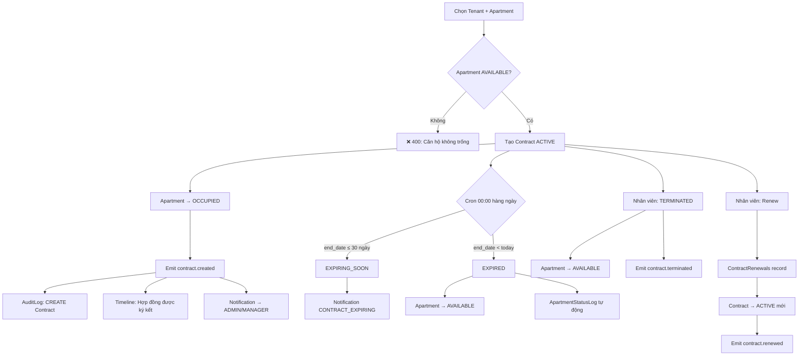
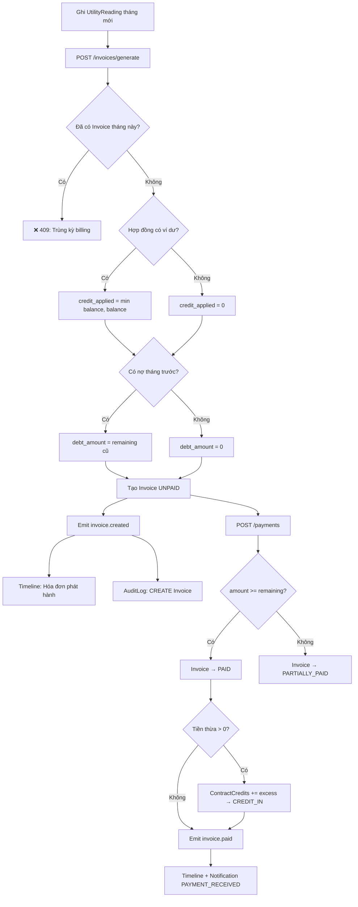
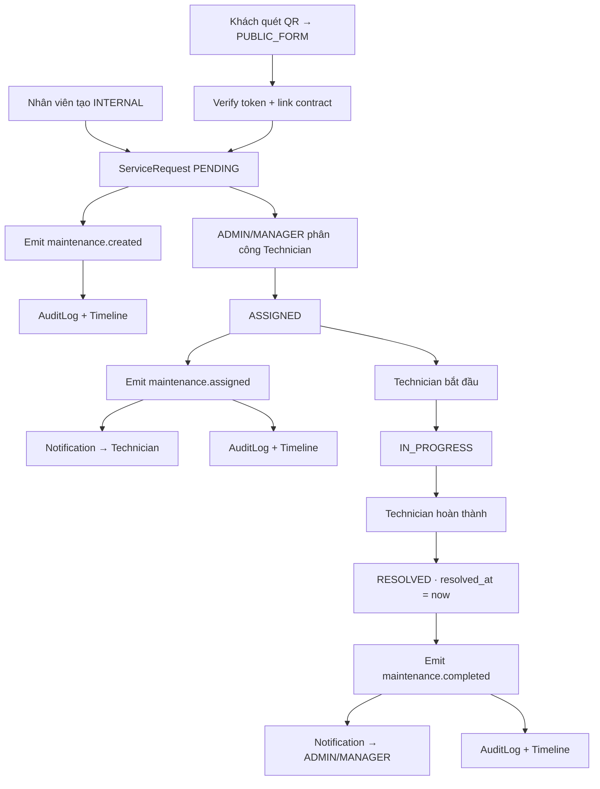

# 🏢 QLCHDC — Hệ thống Quản lý Căn hộ Dịch vụ

> Hệ thống quản lý nội bộ dành cho nhân viên vận hành tòa nhà (Admin, Manager, Receptionist, Technician).  
> Kiến trúc **Monorepo** + **Event-Driven** + **Real-time Socket.io**.

---

## 📐 Module Overview

Hệ thống giải quyết toàn bộ vòng đời nghiệp vụ quản lý căn hộ dịch vụ:

| Bài toán | Module giải quyết |
|----------|------------------|
| Xác thực & phân quyền nhân viên | `auth` |
| Quản lý tài sản bất động sản | `building` |
| Hồ sơ & cư trú khách thuê | `tenant` |
| Vòng đời hợp đồng thuê | `contract` |
| Tài chính hàng tháng (điện/nước/hóa đơn) | `finance` |
| Tiếp nhận & xử lý sự cố kỹ thuật | `service-requests` |
| Chi phí vận hành tòa nhà | `expense` |
| Thông báo real-time | `notifications` |
| Lịch sử kiểm tra toàn hệ thống | `audit-log` |
| Tìm kiếm toàn cầu | `search` |
| Lịch vận hành | `calendar` |
| Phân quyền theo tòa nhà (RBAC+) | `policy` |
| Quy trình nghiệp vụ linh hoạt | `workflow` |
| Quy tắc nghiệp vụ động | `rules` |
| Đính kèm tài liệu | `attachments` |
| Bình luận nội bộ | `comments` |
| Báo cáo thống kê | `report` |
| Form công khai qua QR | `public` |

---

## 🏛️ System Architecture

```
┌─────────────────────────────────────────────────────┐
│             Frontend (React + Vite + TailwindCSS)   │
│  30 Pages · Axios + TanStack Query · Socket.io-client│
└────────────────────┬────────────────────────────────┘
                     │ HTTP/WebSocket
┌────────────────────▼────────────────────────────────┐
│              Backend (Express.js · ESM · Port 3001)  │
│                                                      │
│  ┌──────────┐  ┌──────────┐  ┌──────────────────┐  │
│  │   Auth   │  │ Building │  │ Contract / Finance│  │
│  └──────────┘  └──────────┘  └──────────────────┘  │
│  ┌──────────┐  ┌──────────┐  ┌──────────────────┐  │
│  │ Expense  │  │ Service  │  │ Policy / Workflow │  │
│  └──────────┘  │ Requests │  │ Rules / Search   │  │
│                └──────────┘  └──────────────────┘  │
│                                                      │
│  ┌──────────────────────────────────────────────┐   │
│  │              Event Hub (in-process)           │   │
│  │  contract.* · invoice.* · maintenance.*       │   │
│  └────────┬───────────┬─────────────────────────┘   │
│           │           │                              │
│  ┌────────▼──┐  ┌─────▼──────┐  ┌───────────────┐  │
│  │AuditLog   │  │ Timeline   │  │ Notification  │  │
│  │ Listener  │  │ Listener   │  │ Listener      │  │
│  └───────────┘  └────────────┘  └───────┬───────┘  │
└──────────────────────────────────────────┼──────────┘
                     │                     │ Socket.io emit
┌────────────────────▼─────────────────┐   │
│         Prisma ORM (ESM)             │   │
│  30 Models · Decimal · Soft Delete   │   │
└────────────────────┬─────────────────┘   │
                     │                     │
┌────────────────────▼─────────────────┐   │
│            MySQL Database            │   │
└──────────────────────────────────────┘   │
                                           ▼
                                  ┌─────────────────┐
                                  │  Browser Client  │
                                  │  (Real-time Notif│
                                  └─────────────────┘
```

**Công nghệ sử dụng:**

| Lớp | Công nghệ |
|-----|-----------|
| **Backend** | Node.js + Express.js (ESM) |
| **Frontend** | React.js + Vite + TailwindCSS |
| **Database** | MySQL + Prisma ORM |
| **Monorepo** | pnpm workspaces |
| **Real-time** | Socket.io |
| **File Storage** | Cloudinary (upload_stream · resource_type: auto) |
| **Containerization** | Docker + docker-compose |
| **Auth** | JWT (Access 8h + Refresh 7d) · bcryptjs |
| **Charts** | Recharts |
| **HTTP Client** | Axios + Interceptors |
| **Server Cache** | TanStack React Query |

---

## 🔄 Business Architecture

```
Nhân viên tạo tòa nhà & căn hộ
         │
         ▼
Tạo hồ sơ Khách thuê (Tenants)
         │
         ▼
Ký Hợp đồng thuê (Contracts)
  ├── Đăng ký Dịch vụ (ServiceSubscriptions)
  ├── Căn hộ → OCCUPIED
  └── Phát sự kiện contract.created
         │
         ▼ (hàng tháng)
Ghi Chỉ số Điện nước (UtilityReadings)
         │
         ▼
Lập Hóa đơn (Invoices)  ←── Cộng dồn nợ + Khấu trừ ví dư
  ├── Tiền thuê + Điện + Nước (khoán theo đầu người) + Dịch vụ
  └── Phát sự kiện invoice.created
         │
         ▼
Khách đóng tiền → Ghi Phiếu thu (Payments)
  ├── PAID / PARTIALLY_PAID / OVERDUE
  ├── Dư → vào ContractCredits (CREDIT_IN)
  └── Phát sự kiện invoice.paid
         │
         ▼
Gia hạn / Chấm dứt Hợp đồng
  ├── Gia hạn → cập nhật end_date, giá thuê mới
  ├── Chấm dứt → TERMINATED + lý do
  └── Hết hạn (Cron 00:00) → EXPIRED + căn hộ → AVAILABLE
         │
         ▼ (song song)
Chi phí Tòa nhà (BuildingExpenses)
  └── PENDING → PAID + Đính kèm chứng từ

Yêu cầu Kỹ thuật (ServiceRequests)
  ├── Nguồn: INTERNAL / PUBLIC_FORM (QR)
  ├── PENDING → ASSIGNED → IN_PROGRESS → RESOLVED
  └── Phát sự kiện maintenance.*

         │ (tất cả hành động phát Event)
         ▼
EventHub → AuditLog · Timeline · Notification
              └── Socket.io → Browser real-time
```

---

## 🗂️ Cấu trúc Monorepo

```
apartment/
├── apps/
│   ├── backend/          ← Express server (server.js · 18 routers · Socket.io)
│   └── frontend/         ← React + Vite (App.jsx · routing · layout)
├── modules/
│   ├── auth/             ← JWT · bcrypt · RBAC middleware
│   ├── building/         ← Tòa nhà · Tầng · Căn hộ · QR Token
│   ├── tenant/           ← Hồ sơ khách thuê · Tạm trú/vắng
│   ├── contract/         ← Vòng đời HĐ · Gia hạn · Chấm dứt · Cron
│   ├── finance/          ← Điện nước · Hóa đơn · Thanh toán · Credit
│   ├── service-requests/ ← Sự cố kỹ thuật · QR Public Form
│   ├── expense/          ← Chi phí tòa nhà · Attachment integration
│   ├── attachments/      ← Cloudinary upload/delete · in-memory multer
│   ├── audit-log/        ← AuditLog listener · Timeline listener
│   ├── notifications/    ← Notification listener · Cron reminder
│   ├── comments/         ← Bình luận theo ServiceRequest
│   ├── search/           ← Global search (5 entities)
│   ├── report/           ← 4 báo cáo aggregation
│   ├── calendar/         ← Calendar events (Contract/Invoice/Maintenance)
│   ├── policy/           ← checkPolicy middleware · applyBuildingScope
│   ├── workflow/         ← State machine · validateTransition
│   ├── rules/            ← Business Rules Engine · CRON scan
│   └── public/           ← Public API không cần auth (QR form)
└── packages/
    └── prisma/           ← Schema 30 models · migrations · seed.js
```

---

## ✅ Business Features

### 🔐 Module Auth

#### Login (Đăng nhập)
- **Purpose**: Xác thực nhân viên và cấp token phiên làm việc
- **Actor**: Tất cả nhân viên
- **Input**: `email`, `password`
- **Output**: `accessToken` (JWT 8h), `refreshToken` (JWT 7d), thông tin user
- **Business Rules**:
  - Email phải tồn tại trong hệ thống
  - `is_active = false` → từ chối đăng nhập
  - Password so sánh với `bcryptjs` (10 salt rounds)
  - Cập nhật `last_login_at` sau mỗi lần đăng nhập thành công
  - Password hash không bao giờ trả về trong response

#### Refresh Token
- **Purpose**: Làm mới Access Token mà không cần đăng nhập lại
- **Business Rules**: Refresh token hợp lệ + user vẫn active → cấp access token mới 8h

#### Change Password (Đổi mật khẩu)
- **Business Rules**: Xác minh mật khẩu cũ trước khi cho phép đổi

#### User Management (ADMIN only)
- Tạo tài khoản: mật khẩu mặc định `password123`, không trùng email
- Cập nhật: **không cho phép đổi email** để tránh conflict
- Toggle Active: khoá/mở tài khoản mà không xóa dữ liệu

---

### 🏗️ Module Building

#### Quản lý Tòa nhà / Tầng / Căn hộ
- **Actor**: ADMIN tạo/xoá · MANAGER cập nhật · tất cả xem
- **Loại phòng**: `STUDIO` / `ONE_BR` / `TWO_BR` / `THREE_BR`
- **Trạng thái căn hộ**: `AVAILABLE` / `OCCUPIED` / `MAINTENANCE` / `RESERVED`
- **Business Rules**:
  - Mỗi thay đổi trạng thái tạo record `ApartmentStatusLogs`
  - Nội thất (`ApartmentFurniture`): condition = `NEW` / `GOOD` / `WORN`
  - Căn hộ có soft delete (`deleted_at`)
  - Tòa nhà có soft delete (`deleted_at`)

#### QR Token
- Token 16 ký tự ngẫu nhiên, thời hạn 90 ngày
- Chỉ 1 token tồn tại/căn hộ (unique constraint)
- Dùng để khách thuê truy cập form báo hỏng không cần đăng nhập

#### Quick Preview
- API `GET /apartments/:id/preview` trả thông tin tóm tắt kèm hợp đồng hiện tại, không lộ thông tin nhạy cảm

---

### 👤 Module Tenant

#### Quản lý Hồ sơ Khách thuê
- **Actor**: ADMIN, MANAGER, RECEPTIONIST
- **Thông tin lưu trữ**: CCCD (unique), ngày sinh, giới tính, địa chỉ thường trú, quốc tịch, nghề nghiệp, avatar
- **Soft delete**: `deleted_at`
- **Tìm kiếm**: theo tên, CCCD, SĐT, email

#### Khai báo Tạm trú / Tạm vắng
- **Loại**: `TEMPORARY_RESIDENCE` / `TEMPORARY_ABSENCE`
- Lưu `destination` (nơi đến) và `reason` (lý do)

---

### 📄 Module Contract

#### Tạo Hợp đồng
- **Actor**: ADMIN, MANAGER
- **Input**: tenant_id, apartment_id, start_date, end_date, monthly_rent, deposit_amount, electricity_price, initial_electricity, soNguoiO, water_price_per_month, payment_due_day, furniture_handover
- **Business Rules**:
  - Căn hộ phải ở trạng thái `AVAILABLE`
  - Sau khi tạo → căn hộ chuyển sang `OCCUPIED`
  - Phát sự kiện `contract.created`
  - Mặc định: `electricity_price = 3500 VNĐ/kWh`, `water_price_per_month = 100.000 VNĐ/người/tháng`
  - `termination_notice_days` mặc định 30 ngày

#### Vòng đời Hợp đồng (Tự động bởi Cron)
```
ACTIVE ──[≤ 30 ngày]──▶ EXPIRING_SOON ──[quá end_date]──▶ EXPIRED
                                                              │
                                                    Căn hộ → AVAILABLE
ACTIVE / EXPIRING_SOON ──[nhân viên]──▶ TERMINATED (kèm lý do)
EXPIRED / TERMINATED ──[nhân viên]──▶ gia hạn → ACTIVE (ContractRenewals)
```

#### Gia hạn (ContractRenewals)
- Cập nhật `end_date`, `monthly_rent` mới (có thể khác)
- Lưu lịch sử gia hạn
- Phát sự kiện `contract.renewed`

#### Chấm dứt
- Phải cung cấp `termination_reason`
- Phát sự kiện `contract.terminated`
- Căn hộ → `AVAILABLE`

---

### 💰 Module Finance

#### Ghi Chỉ số Điện nước (UtilityReadings)
- **Unique constraint**: `(apartment_id, billing_month)`
- **Business Rules**:
  - `electricity_curr >= electricity_prev` (validate phía frontend khi import Excel)
  - `water_prev`, `water_curr` lưu `null` (nước tính khoán theo `soNguoiO`)
  - Hỗ trợ bulk import qua Excel (.xlsx) với preview + chỉnh sửa trực tiếp

#### Lập Hóa đơn (Invoices)
- **Business Rules**:
  - Unique: `(contract_id, billing_month)` — không tạo trùng
  - Công thức: `total = rent + electricity + water + service + other_amount - credit_applied + debt_amount`
  - `electricity = (curr - prev) × electricity_unit_price`
  - `water = water_price_per_month` (từ Hợp đồng, không tính theo m³)
  - `due_date` = ngày `payment_due_day` của tháng KẾ TIẾP sau `billing_month`
  - Trước khi tạo: kiểm tra ví dư (`credit`) → khấu trừ tự động (`CREDIT_APPLY`)
  - Trước khi tạo: kiểm tra hóa đơn cũ chưa thanh toán → cộng `debt_amount`
  - Phát sự kiện `invoice.created`

#### Ghi nhận Thanh toán (Payments)
- **Phương thức**: `CASH` / `BANK_TRANSFER`
- **Business Rules**:
  - Thanh toán đủ hoặc thừa → `PAID` + phần thừa vào `ContractCredits` (`CREDIT_IN`)
  - Thanh toán một phần → `PARTIALLY_PAID`
  - Phát sự kiện `invoice.paid`

#### Ví dư & Công nợ (ContractCredits)
- `CREDIT_IN`: tiền thừa vào ví
- `CREDIT_APPLY`: khấu trừ khi lập hóa đơn mới
- `CREDIT_REFUND`: hoàn tiền thủ công (ADMIN/MANAGER)

#### Hóa đơn Quá hạn (OVERDUE)
- Tự động bởi Cron 00:00: `UNPAID/PARTIALLY_PAID` + `due_date < today` → `OVERDUE`
- Gửi notification cho toàn bộ ADMIN/MANAGER

---

### 🔧 Module Service Requests

#### Tạo Yêu cầu
- **Nguồn INTERNAL**: nhân viên tạo trong hệ thống
- **Nguồn PUBLIC_FORM**: khách thuê quét QR → form công khai → tự liên kết với hợp đồng đang active của căn hộ đó
- **Loại**: `MAINTENANCE` / `CLEANING` / `COMPLAINT` / `OTHER`
- **Độ ưu tiên**: `LOW` / `NORMAL` / `HIGH` / `URGENT`

#### Vòng đời
```
PENDING ──[Assign]──▶ ASSIGNED ──[Start]──▶ IN_PROGRESS ──[Done]──▶ RESOLVED
   │                                                                    │
   └──[Cancel]──▶ CANCELLED                                   resolved_at = now()
```
- Phát sự kiện: `maintenance.created`, `maintenance.assigned`, `maintenance.completed`
- `scheduled_start_date`: lên lịch bảo trì định kỳ

#### Chi phí Sửa chữa (ServiceRequestExpenses)
- Ghi nhận chi phí vật tư/nhân công kèm theo yêu cầu
- `onDelete: Cascade` khi xóa ServiceRequest

---

### 💸 Module Expense (Chi phí Tòa nhà)

#### CRUD Chi phí
- **Category**: `OPERATIONS` (vận hành) / `MAINTENANCE` (bảo trì)
- **Status**: `PENDING` → `PAID`
- **Actor**:
  - Create / Update / Update Status: ADMIN, MANAGER, RECEPTIONIST
  - Delete (soft): ADMIN only
- **Business Rules**:
  - `amount > 0` (validate trong service)
  - Soft delete: `deleted_at`
  - Không cho phép tạo với `amount ≤ 0`
  - Đính kèm file chứng từ qua Attachments module (`entity_type = 'BuildingExpense'`)

#### Thống kê
- API `GET /expense/summary`: tổng chi phí PAID theo category, lọc theo building_id, year, month
- Tích hợp vào Dashboard: "Chi phí tháng này", "Lợi nhuận gộp" (Thực thu - Chi phí PAID)

---

### 📎 Module Attachments

#### Upload File
- **Lưu trữ**: Cloudinary (upload qua stream, `resource_type: 'auto'`)
- **Cho phép**: PDF, JPEG, PNG, WEBP
- **Giới hạn**: 10 MB/file
- **Entity hỗ trợ**: `ServiceRequest`, `Contract`, `Invoice`, `Tenant`, `BuildingExpense`

#### Xóa File
- Xóa trên Cloudinary trước (detect resource_type: `image` vs `raw`)
- Xóa record trong DB sau
- **Quyền xóa**: người upload **hoặc** ADMIN/MANAGER
- Nếu Cloudinary báo lỗi → vẫn xóa DB (graceful degradation)

---

### 🔔 Module Notifications

#### Loại Notification

| Type | Trigger | Receiver |
|------|---------|---------|
| `CONTRACT_CREATED` | Event `contract.created` | All ADMIN, MANAGER |
| `PAYMENT_RECEIVED` | Event `invoice.paid` | All ADMIN, MANAGER |
| `MAINTENANCE_ASSIGNED` | Event `maintenance.assigned` | Technician được giao |
| `MAINTENANCE_RESOLVED` | Event `maintenance.completed` | All ADMIN, MANAGER |
| `MAINTENANCE_REMINDER` | Cron 00:00 (scheduled_start_date ≤ 2 ngày) | Technician (nếu đã giao) hoặc ADMIN/MANAGER |
| `CONTRACT_EXPIRING` | Cron 00:00 (end_date ≤ 30 ngày) | All ADMIN, MANAGER |
| `INVOICE_OVERDUE` | Cron 00:00 (due_date < today) | All ADMIN, MANAGER |
| `CONTRACT_EXPIRING_RULE` | Business Rules Engine scan | Người tạo hợp đồng |
| `INVOICE_OVERDUE_RULE` | Business Rules Engine scan | ADMIN, MANAGER + người tạo |
| `MAINTENANCE_REMINDER_RULE` | Business Rules Engine scan | Technician hoặc ADMIN/MANAGER |

- **Real-time**: Socket.io emit to room `user:{userId}` ngay khi notification được tạo
- **Duplicate prevention**: Cron check `findFirst` trước khi tạo để không spam

---

### 📋 Module Audit Log

Ghi nhận tất cả hành động nghiệp vụ quan trọng thông qua Event:

| Event lắng nghe | Action | ResourceType |
|----------------|--------|-------------|
| `contract.created` | CREATE | Contract |
| `contract.updated` | UPDATE | Contract |
| `contract.terminated` | DELETE | Contract |
| `contract.renewed` | UPDATE | Contract |
| `invoice.created` | CREATE | Invoice |
| `invoice.paid` | UPDATE | Invoice |
| `maintenance.created` | CREATE | ServiceRequest |
| `maintenance.assigned` | UPDATE | ServiceRequest |
| `maintenance.completed` | UPDATE | ServiceRequest |

- Lỗi audit log **không làm fail** request chính (try/catch riêng biệt)
- `actorId = 0` + `actorName = 'Hệ thống'` cho các action từ Cron
- API lọc: theo `userId`, `action`, `resourceType`, `from`, `to`, `keyword`

---

### 📅 Module Calendar

Tổng hợp 3 loại sự kiện trong khoảng thời gian [start, end]:

| Type | Color | Nguồn dữ liệu |
|------|-------|--------------|
| `CONTRACT_EXPIRY` | 🟠 orange | Contracts với status ACTIVE/EXPIRING_SOON |
| `PAYMENT_DUE` | 🔴 red | Invoices chưa thanh toán (chỉ khi remaining > 0) |
| `MAINTENANCE` | 🔵 blue | ServiceRequests type=MAINTENANCE có scheduled_start_date |

---

### 🔍 Module Search

Global search tối thiểu 2 ký tự, truy vấn song song 5 entity:

| Entity | Fields tìm kiếm |
|--------|----------------|
| Tenants | full_name, phone, national_id, email |
| Apartments | apartment_code |
| Buildings | name, code |
| Contracts | contract_code |
| Invoices | invoice_code |

Mỗi entity trả tối đa **5 kết quả**.

---

### ⚙️ Module Workflow Engine

Quản lý state machine linh hoạt không hard-code:
- CRUD `Workflows` → `WorkflowSteps` → `WorkflowTransitions`
- `validateTransition(workflowName, fromStep, toStep, userRole)` — throw error nếu transition không hợp lệ
- `role_allowed` trên mỗi Transition: ADMIN bypass, role khác phải khớp
- Chỉ ADMIN được cấu hình Workflow

---

### 📐 Module Business Rules Engine

Đánh giá quy tắc nghiệp vụ từ database, không hard-code:

| Entity | Field | Operators hỗ trợ |
|--------|-------|-----------------|
| Contract | `days_remaining` | `<=` |
| Invoice | `days_overdue` | `>=` |
| ServiceRequest | `days_to_start` | `<=` |

- Trigger: CRON hàng ngày + API thủ công `POST /rules/trigger-scan`
- Duplicate prevention: check notification cùng ngày trước khi tạo
- Chỉ ADMIN được CRUD rules

---

### 🛡️ Module Policy (RBAC+)

Nâng cấp RBAC cơ bản thành Resource-level permission theo tòa nhà:

| Chức năng | Mô tả |
|-----------|-------|
| `assignBuilding(userId, buildingId)` | Phân công tòa nhà cho MANAGER/TECHNICIAN/RECEPTIONIST |
| `revokeAssignment(assignmentId)` | Thu hồi phân công (soft: `revoked_at`) |
| `checkPolicy(resourceType, action)` | Middleware xác thực quyền truy cập resource cụ thể |
| `applyBuildingScope(user, where)` | Lọc Prisma query theo tòa nhà được gán |

Resource types hỗ trợ: `Building`, `BuildingExpense`, `Apartment`, `Contract`, `Invoice`, `ServiceRequest`

---

## 🗄️ Database Model

### Core Domain Models

#### `Users` — Tài khoản nhân viên
| Field | Type | Mô tả |
|-------|------|-------|
| id | Int PK | Auto increment |
| email | String UNIQUE | Tài khoản đăng nhập |
| password_hash | String | bcrypt 10 rounds |
| full_name | String | Tên hiển thị |
| phone | String? | SĐT |
| role | Enum | ADMIN / MANAGER / TECHNICIAN / RECEPTIONIST |
| is_active | Boolean | Soft lock (default: true) |
| last_login_at | DateTime? | Cập nhật sau mỗi login |

#### `Buildings` — Tòa nhà
| Field | Type | Mô tả |
|-------|------|-------|
| id | Int PK | |
| code | String UNIQUE | Mã tòa nhà |
| name | String | Tên tòa nhà |
| address | Text | Địa chỉ |
| total_floors | Int | Số tầng |
| deleted_at | DateTime? | Soft delete |

**Relations**: → Floors → BuildingExpenses → BuildingAssignments

#### `Floors` — Tầng
| Field | Type | Mô tả |
|-------|------|-------|
| building_id | Int FK | → Buildings |
| floor_number | Int | Số tầng |

**Index**: `building_id`

#### `Apartments` — Căn hộ
| Field | Type | Mô tả |
|-------|------|-------|
| floor_id | Int FK | → Floors |
| apartment_code | String UNIQUE | Mã căn hộ |
| room_type | Enum | STUDIO / ONE_BR / TWO_BR / THREE_BR |
| area_sqm | Decimal(6,2) | Diện tích m² |
| max_occupants | Int | Số người tối đa |
| base_price | Decimal(15,2) | Giá thuê cơ bản |
| deposit_amount | Decimal(15,2) | Tiền đặt cọc |
| status | Enum | AVAILABLE / OCCUPIED / MAINTENANCE / RESERVED |
| deleted_at | DateTime? | Soft delete |

**Indexes**: `floor_id`, `status`

#### `Tenants` — Khách thuê
| Field | Type | Mô tả |
|-------|------|-------|
| national_id | String UNIQUE | Số CCCD |
| national_id_issued_date | Date | Ngày cấp CCCD |
| national_id_issued_place | String | Nơi cấp CCCD |
| date_of_birth | Date | Ngày sinh |
| gender | Enum | MALE / FEMALE / OTHER |
| nationality | String | Mặc định: "Việt Nam" |
| permanent_address | Text | Địa chỉ thường trú |
| occupation | String? | Nghề nghiệp |
| avatar_url | String? | URL ảnh đại diện |
| deleted_at | DateTime? | Soft delete |

**Indexes**: `national_id`, `phone`

#### `Contracts` — Hợp đồng thuê
| Field | Type | Mô tả |
|-------|------|-------|
| contract_code | String UNIQUE | Mã hợp đồng |
| tenant_id | Int FK | → Tenants |
| apartment_id | Int FK | → Apartments |
| start_date / end_date | Date | Kỳ hiệu lực |
| monthly_rent | Decimal(15,2) | Giá thuê tháng |
| deposit_amount | Decimal(15,2) | Tiền đặt cọc |
| payment_due_day | Int | Ngày đến hạn trong tháng |
| status | Enum | ACTIVE / EXPIRING_SOON / EXPIRED / TERMINATED |
| soNguoiO | Int | Số người ở (dùng tính nước) |
| water_price_per_month | Decimal(15,2) | Tiền nước khoán/tháng |
| electricity_price | Decimal(10,2) | Đơn giá điện (VNĐ/kWh) |
| initial_electricity | Decimal(10,2) | Chỉ số điện đầu hợp đồng |
| termination_notice_days | Int | Mặc định: 30 ngày |
| furniture_handover | Text? | Biên bản bàn giao nội thất |
| termination_reason | Text? | Lý do chấm dứt |
| deleted_at | DateTime? | Soft delete |

**Indexes**: `tenant_id`, `apartment_id`, `status`, `end_date`, `(status, end_date)`, `(apartment_id, status)`, `(tenant_id, status)`

#### `Invoices` — Hóa đơn
| Field | Type | Mô tả |
|-------|------|-------|
| invoice_code | String UNIQUE | Mã hóa đơn |
| contract_id | Int FK | → Contracts |
| apartment_id | Int FK | → Apartments |
| billing_month | String | Kỳ tháng (YYYY-MM) |
| rent_amount | Decimal(15,2) | Tiền thuê |
| electricity_amount | Decimal(15,2) | Tiền điện |
| water_amount | Decimal(15,2) | Tiền nước |
| service_amount | Decimal(15,2) | Tiền dịch vụ |
| other_amount | Decimal(15,2) | Phụ thu (mặc định 0) |
| credit_applied | Decimal(15,2) | Ví dư đã khấu trừ |
| debt_amount | Decimal(15,2) | Nợ cộng dồn từ tháng trước |
| total_amount | Decimal(15,2) | Tổng phải thu |
| status | Enum | UNPAID / PARTIALLY_PAID / PAID / OVERDUE |
| due_date | Date | Hạn thanh toán |
| deleted_at | DateTime? | Soft delete |

**Unique**: `(contract_id, billing_month)` — không tạo trùng kỳ  
**Indexes**: `status`, `due_date`, `(status, due_date)`

#### `Payments` — Phiếu thu
| Field | Type | Mô tả |
|-------|------|-------|
| invoice_id | Int FK | → Invoices |
| amount | Decimal(15,2) | Số tiền thu |
| payment_method | Enum | CASH / BANK_TRANSFER |
| payment_date | Date | Ngày thu |
| reference_number | String? | Số tham chiếu chuyển khoản |

**Index**: `invoice_id`

#### `UtilityReadings` — Chỉ số điện nước
| Field | Type | Mô tả |
|-------|------|-------|
| apartment_id | Int FK | → Apartments |
| billing_month | String | YYYY-MM |
| electricity_prev / curr | Decimal(10,2) | Chỉ số điện cũ/mới |
| water_prev / curr | Decimal? | NULL (nước tính khoán) |
| electricity_unit_price | Decimal(10,2) | Đơn giá điện tại thời điểm ghi |
| soNguoiO | Int | Số người ở tại thời điểm ghi |

**Unique**: `(apartment_id, billing_month)`

#### `ServiceRequests` — Yêu cầu kỹ thuật
| Field | Type | Mô tả |
|-------|------|-------|
| apartment_id | Int FK | → Apartments |
| contract_id | Int? FK | → Contracts (nếu có) |
| type | Enum | MAINTENANCE / CLEANING / COMPLAINT / OTHER |
| priority | Enum | LOW / NORMAL / HIGH / URGENT |
| status | Enum | PENDING / ASSIGNED / IN_PROGRESS / RESOLVED / CANCELLED / POSTPONED |
| source | Enum | INTERNAL / PUBLIC_FORM |
| requester_name / phone | String? | Thông tin người báo (khi PUBLIC_FORM) |
| assigned_to | Int? FK | → Users (Technician) |
| resolved_at | DateTime? | Thời điểm hoàn thành |
| scheduled_start_date | Date? | Lịch bảo trì dự kiến |

**Indexes**: `apartment_id`, `contract_id`, `assigned_to`, `status`

#### `BuildingExpenses` — Chi phí tòa nhà
| Field | Type | Mô tả |
|-------|------|-------|
| building_id | Int FK | → Buildings |
| category | Enum | OPERATIONS / MAINTENANCE |
| title | String | Tên khoản chi |
| amount | Decimal(15,2) | Số tiền (phải > 0) |
| expense_date | Date | Ngày phát sinh |
| status | Enum | PENDING / PAID |
| deleted_at | DateTime? | Soft delete |

**Indexes**: `building_id`, `status`, `expense_date`

---

### Supporting Models

#### `AuditLogs` — Nhật ký kiểm tra
| Field | Type | Mô tả |
|-------|------|-------|
| actor_id | Int | ID người thực hiện (0 = hệ thống) |
| actor_name | String | Snapshot tên tại thời điểm action |
| action | String | CREATE / UPDATE / DELETE |
| resource_type | String | Contract / Invoice / ServiceRequest... |
| resource_id | Int? | ID bản ghi bị tác động |
| old_data / new_data | Json? | Snapshot dữ liệu trước/sau |
| ip_address | String? | IP client |

**Indexes**: `actor_id`, `(resource_type, resource_id)`, `created_at`

#### `Notifications` — Thông báo
| Field | Type | Mô tả |
|-------|------|-------|
| user_id | Int | Người nhận |
| title / message | String | Nội dung |
| type | String | Loại: CONTRACT_EXPIRING, INVOICE_OVERDUE... |
| entity_type / entity_id | String?/Int? | Liên kết tới entity (extensible) |
| is_read | Boolean | Mặc định false |

**Indexes**: `(user_id, is_read)`, `created_at`

#### `Timeline` — Dòng thời gian sự kiện
| Field | Type | Mô tả |
|-------|------|-------|
| entity_type / entity_id | String/Int | Entity liên quan |
| title / description | String | Mô tả sự kiện |
| actor_id / actor_name | Int?/String? | Người thực hiện |

**Index**: `(entity_type, entity_id)`

#### `Attachments` — File đính kèm
| Field | Type | Mô tả |
|-------|------|-------|
| file_name / file_url | String | Tên file và URL Cloudinary |
| file_size | Int | Bytes |
| mime_type | String | application/pdf, image/jpeg... |
| entity_type / entity_id | String/Int | Liên kết polymorphic |
| uploaded_by | Int FK | → Users |

**Index**: `(entity_type, entity_id)`

#### `BuildingAssignments` — Phân công tòa nhà
| Field | Type | Mô tả |
|-------|------|-------|
| user_id | Int FK | → Users |
| building_id | Int FK | → Buildings |
| assigned_by | Int FK | → Users (ADMIN) |
| revoked_at | DateTime? | Soft revoke |

**Unique**: `(user_id, building_id)`

#### `BusinessRules` — Quy tắc nghiệp vụ động
| Field | Type | Mô tả |
|-------|------|-------|
| name | String UNIQUE | Tên rule |
| entity | String | Contract / Invoice / ServiceRequest |
| condition | Json | `{ field, operator, value }` |
| action | String | SEND_NOTIFICATION... |
| action_data | Json? | Template message |
| is_active | Boolean | Bật/tắt rule |

#### `Workflows` / `WorkflowSteps` / `WorkflowTransitions` — State Machine
- `WorkflowSteps`: `is_initial`, `is_final`, `order_number`
- `WorkflowTransitions`: `from_step_id → to_step_id`, `role_allowed` (CSV)
- `onDelete: Cascade` theo chuỗi Workflow → Steps → Transitions

#### `ContractCredits` / `CreditTransactions` — Ví dư
- `ContractCredits`: balance mỗi hợp đồng
- `CreditTransactions`: type = `CREDIT_IN` / `CREDIT_APPLY` / `CREDIT_REFUND`
- `onDelete: Cascade` khi xóa Contract

#### Các model khác
- `ApartmentFurniture`: danh mục nội thất, condition = NEW/GOOD/WORN
- `ApartmentStatusLogs`: lịch sử thay đổi trạng thái căn hộ
- `ApartmentTokens`: QR token 16 ký tự, expires_at 90 ngày
- `ContractRenewals`: lịch sử gia hạn
- `TemporaryRegistrations`: khai báo tạm trú/vắng
- `Services` + `ServiceSubscriptions`: dịch vụ đi kèm hợp đồng
- `ServiceRequestComments`: bình luận nội bộ (`onDelete: Cascade`)
- `ServiceRequestExpenses`: chi phí sửa chữa (`onDelete: Cascade`)

---

## 🔌 API Documentation

### Auth — `/api/auth`

| Method | Route | Mô tả | Permission |
|--------|-------|-------|-----------|
| POST | `/login` | Đăng nhập | Public |
| POST | `/refresh` | Làm mới Access Token | Public |
| POST | `/logout` | Đăng xuất | Auth |
| GET | `/me` | Thông tin user hiện tại | Auth |
| PUT | `/change-password` | Đổi mật khẩu | Auth |
| GET | `/users` | Danh sách nhân viên | ADMIN |
| POST | `/users` | Tạo tài khoản | ADMIN |
| PUT | `/users/:id` | Cập nhật nhân viên | ADMIN |
| PATCH | `/users/:id/toggle-active` | Khoá/mở tài khoản | ADMIN |

**Possible Errors (Login)**:
- `401` — Sai thông tin đăng nhập
- `401` — Tài khoản đã bị khóa

### Building — `/api/building`

| Method | Route | Permission |
|--------|-------|-----------|
| GET | `/buildings` | Auth |
| GET | `/buildings/:id` | Auth |
| POST | `/buildings` | ADMIN |
| PUT | `/buildings/:id` | ADMIN, MANAGER |
| GET | `/buildings/:id/floors` | Auth |
| POST | `/buildings/:id/floors` | ADMIN, MANAGER |
| GET | `/apartments` | Auth |
| GET | `/apartments/:id` | Auth |
| GET | `/apartments/:id/preview` | Auth |
| POST | `/apartments` | ADMIN, MANAGER |
| PUT | `/apartments/:id` | ADMIN, MANAGER |
| PATCH | `/apartments/:id/status` | Auth |
| GET | `/apartments/:id/status-logs` | Auth |
| GET | `/apartments/:id/furniture` | Auth |
| POST | `/apartments/:id/furniture` | Auth |
| PUT | `/furniture/:id` | Auth |
| DELETE | `/furniture/:id` | ADMIN |
| POST | `/apartments/:id/generate-token` | ADMIN, MANAGER |

### Contract — `/api/contract`

| Method | Route | Permission | Policy |
|--------|-------|-----------|--------|
| GET | `/` | ADMIN, MANAGER | — |
| GET | `/expiring-soon` | ADMIN, MANAGER | — |
| GET | `/:id` | ADMIN, MANAGER, RECEPTIONIST | checkPolicy(Contract, read) |
| POST | `/` | ADMIN, MANAGER | — |
| PUT | `/:id` | ADMIN, MANAGER | checkPolicy(Contract, update) |
| PATCH | `/:id/terminate` | ADMIN, MANAGER | checkPolicy(Contract, delete) |
| POST | `/:id/renew` | ADMIN, MANAGER | checkPolicy(Contract, update) |
| GET | `/:id/renewals` | ADMIN, MANAGER | checkPolicy(Contract, read) |
| GET | `/:id/audit-history` | ADMIN, MANAGER, RECEPTIONIST | checkPolicy(Contract, read) |

### Finance — `/api/finance`

| Method | Route | Permission | Policy |
|--------|-------|-----------|--------|
| GET | `/utilities` | ADMIN, MANAGER, RECEPTIONIST | — |
| POST | `/utilities` | ADMIN, MANAGER, RECEPTIONIST | — |
| POST | `/utilities/bulk-import` | ADMIN, MANAGER, RECEPTIONIST | — |
| POST | `/utilities/import-preview` | ADMIN, MANAGER, RECEPTIONIST | — |
| POST | `/utilities/bulk-save` | ADMIN, MANAGER, RECEPTIONIST | — |
| GET | `/utilities/template` | ADMIN, MANAGER, RECEPTIONIST | — |
| GET | `/invoices` | ADMIN, MANAGER, RECEPTIONIST | — |
| GET | `/invoices/:id` | ADMIN, MANAGER, RECEPTIONIST | checkPolicy(Invoice, read) |
| POST | `/invoices/generate` | ADMIN, MANAGER | — |
| PATCH | `/invoices/:id/status` | ADMIN, MANAGER | checkPolicy(Invoice, update) |
| POST | `/payments` | ADMIN, MANAGER, RECEPTIONIST | — |
| GET | `/contracts/:id/credits` | ADMIN, MANAGER, RECEPTIONIST | checkPolicy(Contract, read) |
| POST | `/contracts/:id/credits/refund` | ADMIN, MANAGER | checkPolicy(Contract, update) |

### Expense — `/api/expense`

| Method | Route | Permission |
|--------|-------|-----------|
| GET | `/` | ADMIN, MANAGER, RECEPTIONIST |
| GET | `/summary` | ADMIN, MANAGER, RECEPTIONIST |
| POST | `/` | ADMIN, MANAGER, RECEPTIONIST |
| PUT | `/:id` | ADMIN, MANAGER, RECEPTIONIST |
| PATCH | `/:id/status` | ADMIN, MANAGER, RECEPTIONIST |
| DELETE | `/:id` | **ADMIN only** |

### Attachments — `/api/attachments`

| Method | Route | Permission |
|--------|-------|-----------|
| GET | `/?entity_type=X&entity_id=Y` | Auth |
| POST | `/upload` | Auth |
| DELETE | `/:id` | Auth (owner hoặc ADMIN/MANAGER) |

### Notifications — `/api/notifications`

| Method | Route |
|--------|-------|
| GET | `/` |
| PATCH | `/:id/read` |
| PATCH | `/read-all` |

### Audit Logs — `/api/audit-logs`

| Method | Route | Permission |
|--------|-------|-----------|
| GET | `/` | ADMIN |
| GET | `/:id` | ADMIN |

### Policy — `/api/policy`

| Method | Route | Permission |
|--------|-------|-----------|
| GET | `/assignments` | ADMIN |
| POST | `/assignments` | ADMIN |
| PATCH | `/assignments/:id/revoke` | ADMIN |

### Workflow — `/api/workflows`

| Method | Route | Permission |
|--------|-------|-----------|
| GET | `/` | ADMIN |
| GET | `/:name` | Auth |
| GET | `/available-transitions` | Auth |
| POST | `/:workflowId/steps` | ADMIN |
| POST | `/:workflowId/transitions` | ADMIN |

### Rules — `/api/rules`

| Method | Route | Permission |
|--------|-------|-----------|
| GET | `/` | ADMIN |
| POST | `/` | ADMIN |
| PUT | `/:id` | ADMIN |
| DELETE | `/:id` | ADMIN |
| POST | `/trigger-scan` | ADMIN |

### Các API khác

| Base | Module |
|------|--------|
| `/api/search` | Global search |
| `/api/calendar` | Calendar events |
| `/api/report` | 4 báo cáo (revenue, occupancy, maintenance, contracts) |
| `/api/service-requests` | CRUD + phân công |
| `/api/comments` | CRUD bình luận ServiceRequest |
| `/api/dashboard` | Stats, revenue, apartment-types, unpaid-invoices, recent-activities |
| `/api/public` | Room info + submit ServiceRequest (không cần auth) |

---

## 📊 Workflow

### Contract Lifecycle



### Invoice Payment Flow



### Service Request Flow



---

## 🔐 Permission Matrix

### Role Scope

| Role | Scope dữ liệu | Ghi chú |
|------|--------------|---------|
| **ADMIN** | **Toàn bộ tòa nhà** | Bypass tất cả policy check |
| **MANAGER** | **Tòa nhà được phân công** | `BuildingAssignments.revoked_at IS NULL` |
| **RECEPTIONIST** | **Tòa nhà được phân công** | Không xem được Technician routes |
| **TECHNICIAN** | **Tòa nhà được phân công** | Chỉ xem Service Requests được giao |

### Permission Matrix chi tiết

| Action | ADMIN | MANAGER | RECEPTIONIST | TECHNICIAN |
|--------|-------|---------|-------------|-----------|
| **Auth** | | | | |
| Login / Refresh | ✓ | ✓ | ✓ | ✓ |
| Manage Users | ✓ | ✗ | ✗ | ✗ |
| **Building** | | | | |
| View Building/Apt | ✓ | ✓ (scope) | ✓ (scope) | ✓ (scope) |
| Create Building | ✓ | ✗ | ✗ | ✗ |
| Create Apartment | ✓ | ✓ | ✗ | ✗ |
| Delete Furniture | ✓ | ✗ | ✗ | ✗ |
| **Contract** | | | | |
| View Contracts | ✓ | ✓ (scope) | ✓ (scope, detail only) | ✗ |
| Create/Terminate/Renew | ✓ | ✓ (scope) | ✗ | ✗ |
| **Finance** | | | | |
| View Invoices | ✓ | ✓ (scope) | ✓ (scope) | ✗ |
| Generate Invoice | ✓ | ✓ | ✗ | ✗ |
| Record Payment | ✓ | ✓ | ✓ | ✗ |
| Refund Credit | ✓ | ✓ | ✗ | ✗ |
| **Expense** | | | | |
| View/Create/Edit Expense | ✓ | ✓ (scope) | ✓ (scope) | ✗ |
| Delete Expense | ✓ | ✗ | ✗ | ✗ |
| **Service Requests** | | | | |
| Create (Internal) | ✓ | ✓ | ✓ | ✗ |
| Assign Technician | ✓ | ✓ | ✗ | ✗ |
| Update Status | ✓ | ✓ | ✗ | ✓ (assigned only) |
| **Workflow/Rules/Policy** | | | | |
| Configure | ✓ | ✗ | ✗ | ✗ |
| **Report** | | | | |
| View Reports | ✓ | ✓ | ✗ | ✗ |
| **Audit Logs** | | | | |
| View All Logs | ✓ | ✗ | ✗ | ✗ |

---

## ⏰ Cron Jobs

### Contract Cron (`0 0 * * *` — nửa đêm hàng ngày)

**File**: `modules/contract/backend/cron.js`

| Bước | Hành động |
|------|----------|
| 1 | Contracts ACTIVE + `end_date ≤ today+30` → `EXPIRING_SOON` + gửi `CONTRACT_EXPIRING` notification |
| 2 | Contracts ACTIVE/EXPIRING_SOON + `end_date < today` → `EXPIRED` |
| 3 | Apartments của contracts vừa EXPIRED → `AVAILABLE` + tạo `ApartmentStatusLog` |
| 4 | Invoices UNPAID/PARTIALLY_PAID + `due_date < today` → `OVERDUE` + gửi `INVOICE_OVERDUE` notification |

### Notifications Cron (`0 0 * * *` — nửa đêm hàng ngày)

**File**: `modules/notifications/backend/cron.js`

| Điều kiện | Hành động |
|-----------|----------|
| ServiceRequest PENDING/ASSIGNED/IN_PROGRESS + `scheduled_start_date ∈ [today, today+2]` | Gửi `MAINTENANCE_REMINDER` cho Technician được giao (nếu có) hoặc toàn bộ ADMIN/MANAGER |
| Duplicate check | `findFirst` trước khi tạo để tránh spam cùng ngày |

---

## 📡 Events Produced

| Event | Phát từ | Payload chính |
|-------|---------|--------------|
| `contract.created` | Contract service | `contract_code`, `start_date`, `apartment_id` |
| `contract.updated` | Contract service | `oldData`, `newData` |
| `contract.terminated` | Contract service | `termination_reason`, `oldData`, `newData` |
| `contract.renewed` | Contract service | `new_end_date`, `new_monthly_rent` |
| `invoice.created` | Finance service | `invoice_code`, `billing_month`, `total_amount` |
| `invoice.paid` | Finance service | `invoiceCode`, `billingMonth`, `paymentAmount`, `paymentMethod`, `newStatus`, `contractId` |
| `maintenance.created` | Service Requests | `title`, `priority` |
| `maintenance.assigned` | Service Requests | `assignedTo`, `title` |
| `maintenance.completed` | Service Requests | `title` |

**Event Payload chuẩn:**
```json
{
  "eventId": "uuid",
  "eventType": "contract.created",
  "actorId": 1,
  "entityId": 100,
  "data": { ... }
}
```

---

## 🔒 Validation Rules

### Contract
- `apartment_id` phải là căn hộ `AVAILABLE`
- `start_date < end_date`
- `monthly_rent > 0`, `deposit_amount >= 0`
- `payment_due_day`: 1–31
- `electricity_price > 0`
- `soNguoiO >= 1`

### Invoice
- Unique `(contract_id, billing_month)`
- Hợp đồng phải đang `ACTIVE` hoặc `EXPIRING_SOON`
- Phải có UtilityReading cho tháng đó

### Expense
- `amount > 0` — validate trong service (throw: "Số tiền chi phí phải lớn hơn 0")
- `building_id`, `category`, `title`, `amount`, `expense_date` là bắt buộc
- Status chỉ nhận `PENDING` hoặc `PAID`

### Attachments
- Chỉ nhận: `application/pdf`, `image/jpeg`, `image/png`, `image/webp`
- Giới hạn: 10 MB
- `entity_type` và `entity_id` bắt buộc

### Auth
- Email không được trùng khi tạo user
- Không cho phép đổi email qua `PUT /users/:id`

### Search
- Tối thiểu 2 ký tự

---

## ⚠️ Exception Catalog

| Error Code | HTTP | Điều kiện |
|------------|------|----------|
| `INVALID_CREDENTIALS` | 401 | Email không tồn tại hoặc sai mật khẩu |
| `ACCOUNT_LOCKED` | 401 | `is_active = false` |
| `TOKEN_EXPIRED` | 401 | Access token hết hạn (8h) |
| `TOKEN_INVALID` | 401 | Token bị giả mạo hoặc sai format |
| `MISSING_TOKEN` | 401 | Không có header Authorization |
| `FORBIDDEN` | 403 | Role không được phép (requireRole) |
| `BUILDING_SCOPE_VIOLATION` | 403 | Entity thuộc tòa nhà không được gán |
| `ATTACHMENT_FORBIDDEN` | 403 | Không phải owner và không phải ADMIN/MANAGER |
| `USER_NOT_FOUND` | 404 | Không tìm thấy người dùng |
| `CONTRACT_NOT_FOUND` | 404 | Không tìm thấy hợp đồng |
| `EXPENSE_NOT_FOUND` | 404 | Không tìm thấy chi phí |
| `ATTACHMENT_NOT_FOUND` | 404 | Không tìm thấy file đính kèm |
| `ASSIGNMENT_NOT_FOUND` | 404 | Không tìm thấy bản ghi phân công |
| `EMAIL_DUPLICATE` | 409 | Email đã tồn tại khi tạo user |
| `INVOICE_DUPLICATE` | 409 | Đã có hóa đơn cho `(contract, billing_month)` |
| `ASSIGNMENT_DUPLICATE` | 409 | User đã được phân công tòa nhà này |
| `INVALID_AMOUNT` | 400 | `amount <= 0` |
| `MISSING_REQUIRED_FIELDS` | 400 | Thiếu field bắt buộc |
| `INVALID_EXPENSE_STATUS` | 400 | Status không phải PENDING hoặc PAID |
| `INVALID_FILE_TYPE` | 400 | MIME type không được hỗ trợ |
| `FILE_TOO_LARGE` | 400 | File > 10MB |
| `MISSING_ENTITY_INFO` | 400 | Thiếu entity_type hoặc entity_id |
| `INVALID_TRANSITION` | 400 | Workflow transition không hợp lệ |
| `APARTMENT_NOT_AVAILABLE` | 400 | Căn hộ không ở trạng thái AVAILABLE |
| `WRONG_OLD_PASSWORD` | 400 | Mật khẩu cũ không khớp khi đổi |

---

## 🧩 Edge Cases

| Tình huống | Xử lý |
|-----------|-------|
| Thanh toán thừa hóa đơn | Phần dư → `ContractCredits` (CREDIT_IN), không trả lại ngay |
| Tạo hóa đơn khi có ví dư | Tự động khấu trừ (`CREDIT_APPLY`) trước khi tạo |
| Khách nợ tháng trước | `debt_amount` cộng vào hóa đơn mới, hóa đơn cũ → PAID với ghi chú |
| Contract EXPIRING_SOON bị Cron chạy lại | Chỉ update `ACTIVE → EXPIRING_SOON`, không chạy lại với EXPIRING_SOON |
| Cron giải phóng căn hộ | Chỉ xử lý contracts có `end_date ∈ [yesterday-2, today)` để tránh chạy lại |
| Cloudinary xóa thất bại | Vẫn xóa record DB (graceful degradation) |
| Notification trùng lặp | `findFirst` check trước khi `createNotification` trong mọi Cron |
| Token QR hết hạn | Trả thông báo lỗi, không lộ thông tin phòng |
| MANAGER không được phân công tòa nhà nào | `applyBuildingScope` inject `building_id: { in: [-1] }` → query trả rỗng |
| Xóa ServiceRequest có Attachment | `ServiceRequestComments` + `ServiceRequestExpenses` cascade delete, Attachments cần xóa riêng |
| Audit log lỗi | Không làm fail request chính — chỉ log error |
| Timeline lỗi | Không làm fail request chính — chỉ log error |

---

## 🔧 Technical Debt

### 🔴 High Priority

| Issue | Vị trí | Rủi ro |
|-------|--------|--------|
| **Thiếu Prisma Transaction** khi generate invoice: tạo Invoice + CREDIT_APPLY + debt rollover không được wrap trong `$transaction` | `finance/backend/service.js` | Race condition khi nhiều request đồng thời |
| **Hard-coded `changed_by: 1`** khi Cron tự động giải phóng căn hộ EXPIRED | `contract/backend/cron.js` L94 | Audit log gán sai người thực hiện (luôn là user ID=1) |
| **Thiếu refresh token revocation**: logout không invalidate refresh token | `auth/backend/service.js` | Refresh token bị đánh cắp vẫn dùng được trong 7 ngày |

### 🟡 Medium Priority

| Issue | Vị trí | Rủi ro |
|-------|--------|--------|
| **N+1 Query risk** trong `getExpenses`: lấy attachment count bằng `groupBy` sau khi lấy danh sách — nếu limit lớn có thể ảnh hưởng hiệu năng | `expense/backend/service.js` | Chậm khi có nhiều record |
| **N+1 trong Business Rules scan**: vòng lặp `for...of` với `createNotification` và `findFirst` bên trong — không batch | `rules/backend/service.js` | Timeout khi nhiều hợp đồng/hóa đơn |
| **Không có DB transaction** khi Cron update contract status + gửi notification — nếu notification fail thì status đã update | `contract/backend/cron.js` | Dữ liệu không nhất quán |

### 🟢 Low Priority

| Issue | Vị trí | Ghi chú |
|-------|--------|---------|
| **Validation logic trùng lặp** giữa controller và service: cả 2 đều check required fields | `expense/backend/controller.js` + `service.js` | Refactor về single layer validation |
| **JWT_SECRET fallback** `'fallback_secret_key'` trong middleware | `auth/backend/middleware.js` | Nên enforce `process.env.JWT_SECRET` required |
| **`resource_type: 'auto'`** khi upload nhưng dùng `'raw'` khi delete | `attachments/backend/` | Cần test kỹ với PDF files |

---

## 💡 Improvement Suggestions

### Must Have
- Wrap invoice generation trong Prisma `$transaction`
- Thêm refresh token blacklist (Redis hoặc DB table)
- Fix hard-coded `changed_by: 1` → nhận system user ID từ config/env

### Should Have
- Batch insert notifications thay vì loop trong Cron
- Rate limiting cho `/api/auth/login` và `/api/public`
- Thêm index `(billing_month, status)` cho `Invoices`
- Middleware tập trung xử lý lỗi (global error handler)

### Nice To Have
- WebSocket room authentication (hiện tại client tự join `user:{userId}` không có verify)
- Background job queue (Bull/BullMQ) thay cho Cron in-process
- API versioning (`/api/v1/`)
- OpenAPI/Swagger documentation tự động

---

## 🚀 Chạy dự án

### Khởi động với Docker
```bash
docker-compose up -d
```

### Khởi động thủ công
```bash
pnpm install

# Migration + seed dữ liệu mẫu
cd packages/prisma
pnpm prisma migrate dev
pnpm prisma db seed

# Backend (port 3001)
cd apps/backend && pnpm dev

# Frontend (port 5173)
cd apps/frontend && pnpm dev
```

### Biến môi trường yêu cầu (`.env`)
```env
DATABASE_URL=mysql://...
JWT_SECRET=...
JWT_REFRESH_SECRET=...
CLOUDINARY_CLOUD_NAME=...
CLOUDINARY_API_KEY=...
CLOUDINARY_API_SECRET=...
CLOUDINARY_FOLDER=qlchdv
FRONTEND_URL=http://localhost:5173
PORT=3001
```

### Tài khoản demo
| Email | Mật khẩu | Vai trò |
|-------|----------|---------| 
| `admin@qlchdc.com` | `password123` | Admin |
| `manager@qlchdc.com` | `password123` | Manager |
| `tech@qlchdc.com` | `password123` | Technician |

---

## 📊 System Statistics

| Metric | Giá trị |
|--------|---------|
| Backend Modules | **18** |
| Frontend Pages | **30** (29 internal + 1 public) |
| API Endpoints | **70+** |
| Database Models | **30** |
| Event Types | **9** |
| Notification Types | **10** |
| Cron Jobs | **2** |
| Supported Roles | **4** |
| Attachment-enabled Modules | **5** (Expense, ServiceRequest, Contract, Invoice, Tenant) |
| Workflow-enabled Modules | **1** (ServiceRequest — configurable, extensible) |
| Seed Data | 24 căn hộ · 16 khách thuê · 16 HĐ · ~80 hóa đơn |

---

## 🎯 Product Level Assessment

| Level | Tính năng yêu cầu | Trạng thái |
|-------|------------------|-----------|
| **Mid-Level** | CRUD cơ bản, Auth, DB schema | ✅ |
| **Strong Mid-Level** | Audit Log, Notification, Attachment, Comment, Timeline, Payment Workflow, Search, Reporting, Export | ✅ |
| **Senior-Level** | + Event Driven Architecture, Workflow Engine, Business Rules Engine, Policy Based Permission | ✅ |
| **Enterprise-Level** | + Dynamic Custom Fields, Saved Views, Advanced Filter Builder, Bulk Actions | 🔲 Planned |
