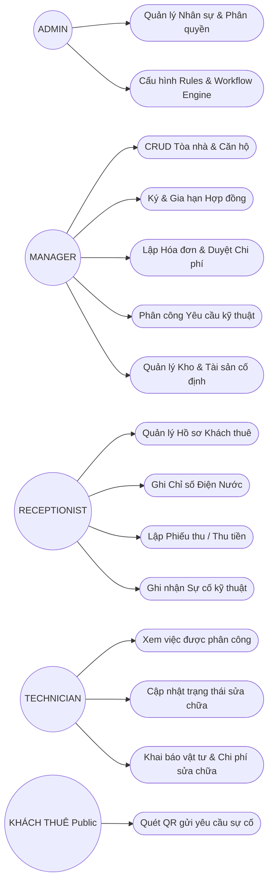
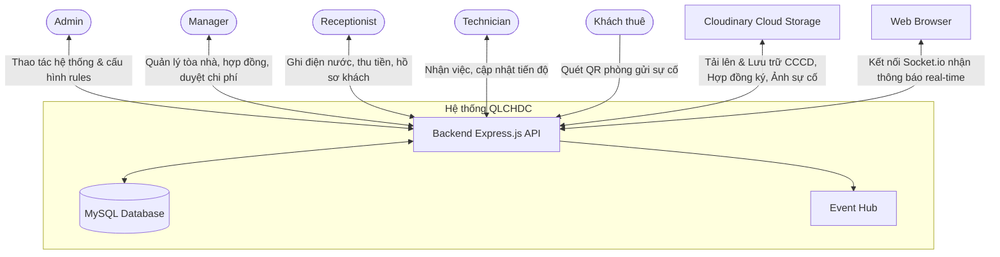

# 🌐 Tổng quan Hệ thống (System Overview)

Tài liệu này cung cấp cái nhìn tổng quan về mặt nghiệp vụ của Hệ thống Quản lý Căn hộ Dịch vụ (QLCHDC), bao gồm các đối tượng tham gia, các ca sử dụng (use cases), thực thể nghiệp vụ chính, và sơ đồ ngữ cảnh hệ thống.

---

## 👥 Đối tượng sử dụng (Actors)

Hệ thống QLCHDC được thiết kế để phục vụ đội ngũ vận hành nội bộ của tòa nhà. Khách thuê không cần tài khoản đăng nhập mà chỉ tương tác qua cổng công cộng (mã QR):

| Actor | Vai trò & Trách nhiệm chính |
|-------|----------------------------|
| **ADMIN (Quản trị viên)** | Toàn quyền kiểm soát hệ thống: quản lý tài khoản nhân viên, cấu hình quy tắc nghiệp vụ động (Rules Engine), thiết lập quy trình trạng thái (Workflow Engine). |
| **MANAGER (Quản lý)** | Vận hành hàng ngày: CRUD tòa nhà/căn hộ/hợp đồng/hóa đơn, phân công yêu cầu kỹ thuật, duyệt chi phí vận hành. |
| **RECEPTIONIST (Lễ tân)** | Tương tác trực tiếp với khách thuê: quản lý hồ sơ khách, ghi nhận chỉ số điện nước, thu tiền lập phiếu thu, tiếp nhận phản ánh sự cố kỹ thuật. |
| **TECHNICIAN (Kỹ thuật viên)** | Xử lý các sự cố kỹ thuật: tiếp nhận công việc được gán, cập nhật trạng thái sửa chữa, ghi nhận chi phí vật tư phát sinh. |
| **KHÁCH THUÊ (Public Guest)** | Tương tác gián tiếp: quét mã QR tại phòng để phản ánh sự cố kỹ thuật mà không cần đăng nhập. |

---

## 🎯 Các Ca sử dụng chính (Key Use Cases)

---

## 🏛️ Tổng quan Miền nghiệp vụ (Domain Overview)

Nghiệp vụ cốt lõi xoay quanh vòng đời của một **Căn hộ (Apartment)** và **Hợp đồng thuê (Contract)**:

1. **Thiết lập hạ tầng**:
   - Một **Tòa nhà (Building)** gồm nhiều **Tầng (Floor)**.
   - Mỗi Tầng có nhiều **Căn hộ (Apartment)**.
2. **Thiết lập cư trú**:
   - **Khách thuê (Tenant)** đăng ký thông tin cá nhân (CCCD, SĐT...).
   - **Hợp đồng thuê (Contract)** được ký kết, liên kết Khách thuê với Căn hộ trống. Lúc này Căn hộ chuyển từ `AVAILABLE` sang `OCCUPIED`.
3. **Vận hành & Tài chính hàng tháng**:
   - Hàng tháng, ghi nhận **Chỉ số điện nước (UtilityReadings)**.
   - Hệ thống tính toán và tự động lập **Hóa đơn (Invoice)**.
   - Thực hiện cấn trừ **Ví dư (ContractCredits)** nếu có tiền đóng dư từ tháng trước.
   - Ghi nhận **Phiếu thu (Payment)** khi khách đóng tiền phòng. Tiền đóng thừa sẽ được nạp ngược lại vào Ví dư.
4. **Bảo trì & Sự cố kỹ thuật**:
   - Khách thuê hoặc Lễ tân phản ánh sự cố tạo thành **Yêu cầu kỹ thuật (ServiceRequest)** (có thể liên kết với một **Tài sản cố định** cụ thể gặp lỗi).
   - Quản lý phân công Kỹ thuật viên xử lý. Phát sinh chi phí ngoài được ghi vào **ServiceRequestExpenses**.
5. **Kho & Tài sản vận hành**:
   - Mỗi Tòa nhà có một hoặc nhiều **Kho (Warehouses)** chứa các **Vật tư (InventoryItems)** phục vụ bảo trì.
   - Các hoạt động nhập/xuất kho được ghi nhận thành **Giao dịch kho (StockTransactions)**. Khi giải quyết sự cố (`RESOLVED`), số vật tư Kỹ thuật viên đã dùng được tự động trừ khỏi kho thông qua câu lệnh cập nhật an toàn chống tranh chấp (Atomic Update).
   - **Tài sản cố định (Assets)** được gán theo tòa nhà, gắn mã QR duy nhất phục vụ tra cứu nhanh và báo sự cố. Giá trị khấu hao lũy kế và giá trị còn lại của tài sản được tự động tính toán theo công thức khấu hao đường thẳng (Straight-Line Depreciation) mỗi khi truy vấn.

---

## 🔗 Sơ đồ Ngữ cảnh (System Context Diagram)

Sơ đồ dưới đây mô tả cách hệ thống QLCHDC tương tác với các nhân viên vận hành, khách thuê và các dịch vụ bên thứ ba:

