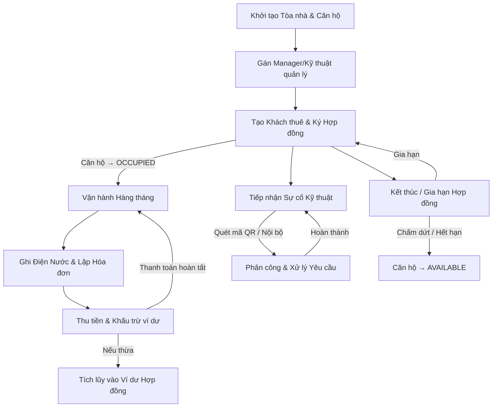
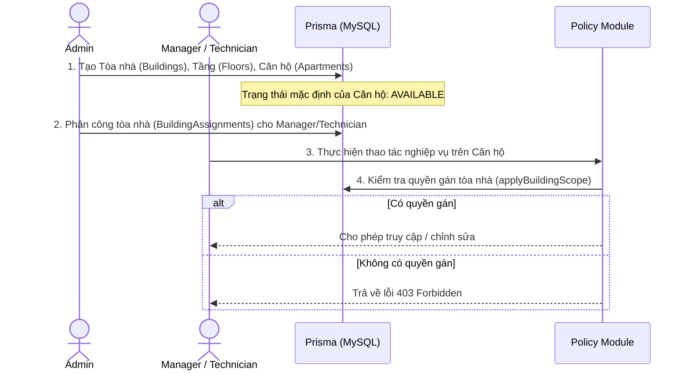
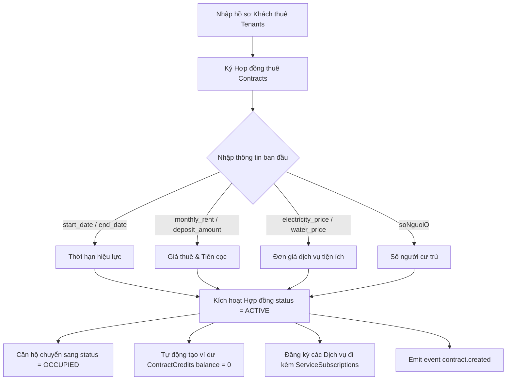
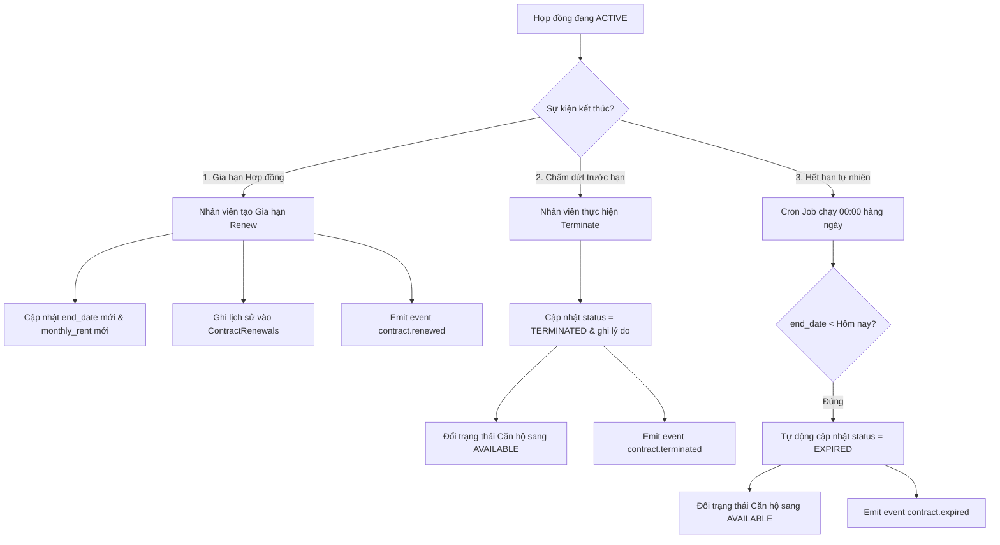
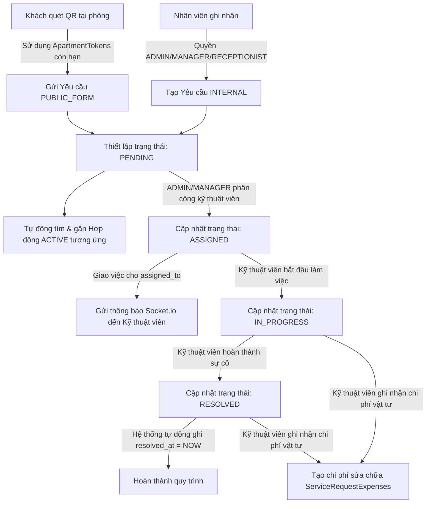
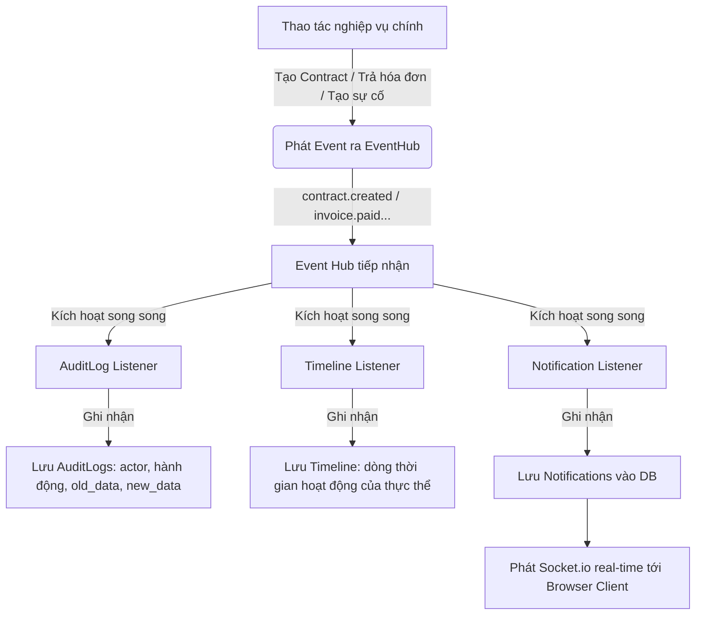

# 🔄 Quy trình Nghiệp vụ (Workflows)

Tài liệu này chi tiết hóa toàn bộ các luồng nghiệp vụ cốt lõi, cơ chế vận hành, và sự tương tác giữa các module trong Hệ thống Quản lý Căn hộ Dịch vụ (QLCHDC).

---

## 🗺️ Tổng quan Vòng đời Nghiệp vụ

Quy trình nghiệp vụ của QLCHDC đi qua các giai đoạn chính từ lúc thiết lập dữ liệu tòa nhà cho đến vận hành hàng tháng, xử lý sự cố, và thanh lý/gia hạn hợp đồng.



---

## 🚪 Quy trình 1: Khởi tạo Hệ thống & Vòng đời Căn hộ (Apartment Lifecycle)

Quy trình này đảm bảo việc quản lý tài sản bất động sản được phân cấp và gán quyền chính xác cho nhân viên vận hành tòa nhà.



### Các Thực thể liên quan:
- `Buildings`: Lưu mã, tên, địa chỉ, tổng số tầng của tòa nhà.
- `Floors`: Gắn với tòa nhà qua `building_id`.
- `Apartments`: Gắn với tầng qua `floor_id`. Trạng thái (`status`) gồm: `AVAILABLE`, `OCCUPIED`, `MAINTENANCE`, `RESERVED`.
- `BuildingAssignments`: Bản ghi liên kết tài khoản nhân viên với tòa nhà mà họ được phân công quản lý.
- `ApartmentStatusLogs`: Tự động ghi lại lịch sử thay đổi trạng thái căn hộ phục vụ kiểm toán và báo cáo.

### Ràng buộc Nghiệp vụ:
- **Soft Delete**: Khi xóa Tòa nhà hoặc Căn hộ, hệ thống ghi nhận `deleted_at` thay vì xóa vật lý khỏi database để bảo toàn lịch sử hóa đơn/hợp đồng.
- **Phân quyền theo Tòa nhà (RBAC+)**: Nhân viên thuộc role `MANAGER`, `RECEPTIONIST`, hoặc `TECHNICIAN` chỉ có quyền xem hoặc thao tác trên các căn hộ thuộc tòa nhà mà họ đã được gán qua `BuildingAssignments`. `ADMIN` có quyền tối cao truy cập tất cả tòa nhà.

---

## 📝 Quy trình 2: Quản lý Khách thuê & Hợp đồng (Tenant & Contract Lifecycle)

Vòng đời hợp đồng là trung tâm của mọi hoạt động tài chính và vận hành trong hệ thống.



### Gia hạn & Chấm dứt Hợp đồng:



### Ràng buộc Nghiệp vụ:
- **Tính tiền nước**: Nếu nước tính khoán theo đầu người, hệ thống nhân `soNguoiO` với `water_price_per_month` để tính tiền nước khi lập hóa đơn.
- **Ràng buộc Hóa đơn**: Khi hợp đồng chuyển sang trạng thái `TERMINATED` hoặc `EXPIRED`, hệ thống sẽ giải phóng căn hộ về `AVAILABLE` nhưng các hóa đơn chưa thanh toán của hợp đồng đó vẫn giữ nguyên để tiếp tục thu hồi công nợ.

---

## ⚡ Quy trình 3: Ghi Chỉ số Điện Nước & Lập Hóa đơn Hàng tháng (Billing & Credit Offset)

Quy trình lập hóa đơn tự động tích hợp cơ chế khấu trừ ví dư (Credit Offset) thông minh giúp giảm thiểu thao tác thủ công.

```mermaid
flowchart TD
    A[Ghi chỉ số Điện Nước UtilityReadings hàng tháng YYYY-MM] --> B[Lập Hóa đơn Invoices cho Hợp đồng]
    B --> C[Tính toán Tiền phải thu]
    Note over C: Tiền phòng + Tiền điện (chênh lệch chỉ số * đơn giá) + Tiền nước + Dịch vụ + Phụ thu
    C --> D{Kiểm tra ví dư của Hợp đồng ContractCredits}
    
    D -- "credit_balance = 0" --> E[amount_due = total_amount]
    E --> F[Invoice status = UNPAID]
    
    D -- "credit_balance > 0" --> G{credit_balance >= total_amount?}
    
    G -- Đúng --> H[Khấu trừ toàn bộ: credit_applied = total_amount]
    H --> I[Cập nhật ví dư: credit_balance = credit_balance - total_amount]
    H --> J[Invoice status = PAID]
    
    G -- Sai --> K[Khấu trừ một phần: credit_applied = credit_balance]
    K --> L[Cập nhật ví dư: credit_balance = 0]
    K --> M[Số tiền còn lại: amount_due = total_amount - credit_applied]
    K --> N[Invoice status = UNPAID]
    
    F & J & N --> O[Emit event invoice.created]
```

### Ràng buộc Nghiệp vụ:
- **Không trùng kỳ**: Mỗi Hợp đồng chỉ được phép tồn tại duy nhất **1 hóa đơn** cho mỗi kỳ tháng `YYYY-MM` (được đảm bảo bằng ràng buộc UNIQUE `(contract_id, billing_month)`).
- **Chỉ số điện nước**: Chỉ số cũ (`electricity_prev`) của tháng này phải tự động lấy từ chỉ số mới (`electricity_curr`) của tháng liền kề trước đó. Nếu là tháng đầu tiên của hợp đồng, hệ thống lấy `initial_electricity` từ Hợp đồng.

---

## 💵 Quy trình 4: Thu tiền & Tích lũy Ví dư (Payment & Credit Roll-over)

Hệ thống hỗ trợ thanh toán linh hoạt nhiều lần cho một hóa đơn và tự động chuyển đổi tiền đóng thừa thành số dư tích lũy.

```mermaid
flowchart TD
    A[Nhân viên tạo Phiếu thu Payments] --> B[Ghi nhận số tiền đóng amount]
    B --> C[Cập nhật tổng tiền đã thanh toán của hóa đơn]
    B --> D{Số tiền đóng >= Số tiền còn nợ (amount_due)?}
    
    D -- Sai --> E[Cập nhật trạng thái Invoice: PARTIALLY_PAID]
    E --> F[Cập nhật nợ còn lại: amount_due = amount_due - amount]
    
    D -- Đúng --> G[Cập nhật trạng thái Invoice: PAID]
    G --> H[Tính tiền thừa: excess_amount = amount - amount_due]
    G --> I{excess_amount > 0?}
    I -- Đúng --> J[Tạo giao dịch nạp CREDIT_IN vào ContractCredits]
    J --> K[Cập nhật số dư ví: credit_balance = credit_balance + excess_amount]
    I -- Sai --> L[Không thay đổi ví dư]
    
    E & G --> M[Emit event invoice.paid]
```

### Ràng buộc Nghiệp vụ:
- **Thanh toán nhiều lần**: 1 Hóa đơn có thể liên kết với nhiều Phiếu thu (`1 Invoice -> N Payments`). Tổng số tiền của các phiếu thu cấu thành trạng thái của hóa đơn (`UNPAID` $\rightarrow$ `PARTIALLY_PAID` $\rightarrow$ `PAID`).
- **Nợ gối đầu (Debt Accumulation)**: Khi lập hóa đơn mới, hệ thống tự động kiểm tra xem khách thuê còn nợ hóa đơn của các tháng trước hay không. Nếu có, số nợ cũ sẽ được cộng dồn vào cột `debt_amount` của hóa đơn mới để yêu cầu thanh toán gộp.

---

## 🛠️ Quy trình 5: Tiếp nhận & Xử lý Sự cố Kỹ thuật (Service Request Lifecycle)

Quy trình xử lý sự cố hỗ trợ cả nguồn nội bộ lẫn nguồn công cộng không cần đăng nhập qua mã QR.



### Ràng buộc Nghiệp vụ:
- **Bảo mật QR Code**: Khách thuê quét mã QR sẽ dùng `ApartmentTokens` gồm mã ngẫu nhiên dài 8-16 ký tự. Token có hạn mặc định 90 ngày. Hệ thống sẽ từ chối tạo yêu cầu nếu token hết hạn.
- **Ràng buộc Cập nhật**: Kỹ thuật viên (`TECHNICIAN`) chỉ được phép cập nhật trạng thái (`status`) của các yêu cầu kỹ thuật được phân công đích danh cho mình. Họ không thể thay đổi trạng thái yêu cầu của người khác.

---

## 📡 Quy trình 6: Kiến trúc Hướng sự kiện & Đồng bộ Real-time (Event-Driven Architecture)

Hệ thống sử dụng Event Hub (in-process) để tách biệt nghiệp vụ chính và các tiến trình bổ trợ, nâng cao tính mở rộng và trải nghiệm người dùng.



### Danh sách các Sự kiện (Events Produced):
1. **Contract**: `contract.created`, `contract.updated`, `contract.terminated`, `contract.renewed`, `contract.expired`.
2. **Invoice & Payment**: `invoice.created`, `invoice.paid`, `payment.received`.
3. **Maintenance**: `maintenance.created`, `maintenance.assigned`, `maintenance.completed`.

### Ràng buộc Nghiệp vụ:
- **Không chặn luồng chính (Non-blocking)**: Các listener được bọc trong các khối `try/catch` độc lập. Nếu quá trình ghi Audit Log hoặc gửi Notification bị lỗi, nghiệp vụ chính (như tạo hợp đồng, trả hóa đơn) vẫn phải thành công bình thường.
- **Cron Jobs**: Khi các tác vụ tự động chạy (ví dụ Cron 00:00 quét hợp đồng hết hạn), `actor_id` được ghi nhận là `0` và `actor_name` là `'Hệ thống'`.
